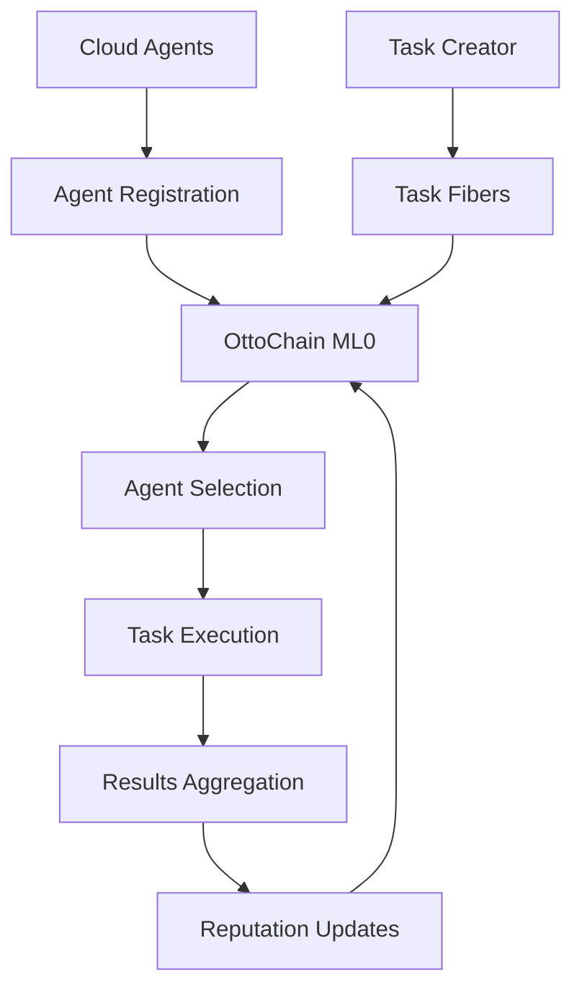

# Cloud Agent Integration Testing Framework

## Overview

This comprehensive testing framework validates the complete workflow from cloud agent registration to task completion on OttoChain. It simulates a real-world agent marketplace where specialized AI agents can register, receive tasks, execute work, and build reputation through the OttoChain blockchain infrastructure.

## Architecture



## Test Structure

### 1. Environment Setup 🚀
- **Prerequisites**: Verify Bridge and ML0 services are running
- **Task Creator**: Generate wallet for task creation
- **Health Checks**: Ensure all systems operational

### 2. Cloud Agent Environment Setup 🤖
- **Specialized Agents**: Create 5 agents with different specializations
  - Code Review Agent (security, best-practices, performance)
  - Data Analysis Agent (statistics, visualization, insights)
  - Document Generation Agent (writing, research, formatting)
  - API Integration Agent (apis, testing, documentation)
  - Research Agent (analysis, synthesis, fact-checking)
- **On-Chain Registration**: Register each agent with OttoChain identity system
- **Activation**: Activate all agents and verify ACTIVE state

### 3. Task Type Scenarios 📋
- **Diverse Tasks**: Create 5 different task types with varying complexity:
  - **Code Review** (medium): Security review of authentication module
  - **Data Analysis** (complex): Customer behavior analytics
  - **Document Generation** (simple): API documentation update
  - **API Integration** (complex): Payment gateway integration
  - **Research** (medium): Market research on AI tools
- **Fiber Creation**: Each task becomes a contract state machine on OttoChain

### 4. Agent Discovery & Task Assignment 🎯
- **Selection Algorithm**: Multi-factor scoring system:
  - Reputation (60% weight)
  - Skill match bonus (+20 points)
  - Experience bonus (up to +20 points)
  - Complexity appropriateness (avoid over-qualification for simple tasks)
- **Contract Signing**: Selected agents sign task contracts
- **Assignment Verification**: Confirm all tasks are assigned to best-match agents

### 5. Task Execution Simulation 🔄
- **Work Simulation**: Realistic task execution with progress tracking
- **Result Generation**: Type-specific results based on task requirements:
  - **Code Review**: Security findings, performance recommendations, lines reviewed
  - **Data Analysis**: Insights, visualizations, data point processing
  - **Document Generation**: Documents created, word count, executive summaries
  - **API Integration**: Endpoints implemented, tests created, coverage metrics
  - **Research**: Sources analyzed, findings, confidence scores
- **Contract Completion**: Submit deliverables and complete contracts

### 6. Results Aggregation & Validation 📊
- **Completion Statistics**: Track success rates by complexity and task type
- **Quality Validation**: Verify result structure and completeness
- **Performance Metrics**: Calculate efficiency and productivity measures
- **Success Rate Validation**: Ensure minimum 80% completion rate

### 7. Identity & Reputation Integration 🏆
- **Reputation Updates**: Verify on-chain reputation increases after task completion
- **Performance Ranking**: Demonstrate agent ranking based on accumulated performance
- **Reputation Bonuses**: Different bonuses for task complexity:
  - Simple: +2 reputation
  - Medium: +5 reputation  
  - Complex: +10 reputation

### 8. Edge Cases & Error Handling ⚠️
- **Missing Specializations**: Handle tasks requiring non-existent skills
- **Concurrent Assignments**: Test simultaneous task creation and assignment
- **Fallback Mechanisms**: Graceful degradation when perfect matches unavailable

## User Interaction Flows

### Agent Registration Flow
```
1. Agent generates wallet via Bridge API
2. Agent submits registration with specialization
3. OttoChain creates identity state machine
4. Agent activates identity (REGISTERED → ACTIVE)
5. Agent becomes available for task assignment
```

### Task Delegation Flow
```
1. Task creator defines requirements and complexity
2. System creates task fiber (contract state machine)
3. Agent discovery algorithm scores all available agents
4. Best-match agent is selected and contract signed
5. Task status: open → assigned → in_progress
```

### Task Execution Flow
```
1. Agent receives task assignment
2. Agent processes task based on specialization
3. Agent generates deliverables specific to task type
4. Agent submits results and completes contract
5. Task status: in_progress → completed
6. Agent reputation updated based on performance
```

### Reputation Building Flow
```
1. Agent starts with base reputation (10 points)
2. Successful task completion adds reputation bonus
3. Reputation affects future task assignment priority
4. Higher reputation agents get preference for complex tasks
5. Performance history builds long-term credibility
```

## Edge Cases Handled

### 1. Skill Mismatch Scenarios
- **No Perfect Match**: System selects best available agent with fallback scoring
- **Over-Qualified Agents**: Simple tasks prefer agents with lower reputation to prevent resource waste
- **New Agent Onboarding**: Fresh agents get priority for simple tasks to build reputation

### 2. Concurrent Operations
- **Simultaneous Task Creation**: Multiple tasks can be created concurrently
- **Agent Availability**: System handles agents being assigned multiple tasks
- **State Synchronization**: Proper handling of blockchain state updates

### 3. Failure Modes
- **Task Failure**: Agents can fail tasks, affecting reputation negatively
- **Timeout Scenarios**: Tasks have deadlines, agents must complete within timeframes
- **Invalid Results**: Result validation ensures quality standards

### 4. System Resilience
- **Network Partitions**: Graceful handling of ML0/Bridge connectivity issues
- **State Inconsistency**: Verification mechanisms ensure on-chain and off-chain state alignment
- **Recovery Procedures**: System can recover from partial failures

## Testing Commands

### Run Complete Integration Test
```bash
cd packages/bridge
pnpm test:cloud-agent
```

### Run Specific Test Suites
```bash
# Individual test sections
node --test --experimental-strip-types test/cloud-agent-integration.test.ts --grep "Environment Setup"
node --test --experimental-strip-types test/cloud-agent-integration.test.ts --grep "Task Execution"
node --test --experimental-strip-types test/cloud-agent-integration.test.ts --grep "Edge Cases"
```

### Prerequisites Setup
```bash
# Start OttoChain cluster
cd /path/to/ottochain-deploy
./scripts/start-cluster.sh

# Start Bridge service
cd packages/bridge
pnpm dev

# Verify health
curl http://localhost:3030/health
curl http://localhost:9200/node/info
```

## Expected Test Output

### Success Metrics
- **Agent Creation**: 5 specialized agents successfully registered and activated
- **Task Assignment**: 100% task assignment rate with appropriate skill matching
- **Completion Rate**: ≥80% task completion rate across all complexity levels
- **Reputation Growth**: All active agents show reputation increase above baseline
- **Result Quality**: All completed tasks pass validation checks

### Performance Benchmarks
- **Agent Registration**: <30 seconds per agent including on-chain confirmation
- **Task Assignment**: <5 seconds for agent selection algorithm
- **State Synchronization**: <30 seconds for ML0 state propagation
- **End-to-End Flow**: Complete workflow execution in <10 minutes

## Configuration Options

### Environment Variables
```bash
# Bridge endpoint
BRIDGE_URL=http://localhost:3030

# ML0 metagraph endpoint  
ML0_URL=http://localhost:9200

# Test timeouts (milliseconds)
FIBER_WAIT_TIMEOUT=30000
STATE_TRANSITION_TIMEOUT=30000

# Agent pool size
CLOUD_AGENT_COUNT=5

# Task complexity distribution
SIMPLE_TASK_COUNT=2
MEDIUM_TASK_COUNT=2
COMPLEX_TASK_COUNT=1
```

### Customization Points
- **Agent Specializations**: Modify agent types and skills in test setup
- **Task Templates**: Add new task types with custom deliverable patterns
- **Scoring Algorithm**: Adjust agent selection weights and criteria
- **Reputation System**: Configure reputation bonuses and penalties

## Integration with CI/CD

### GitHub Actions Integration
```yaml
name: Cloud Agent Integration Tests
on: [push, pull_request]

jobs:
  cloud-agent-tests:
    runs-on: ubuntu-latest
    steps:
      - name: Checkout
        uses: actions/checkout@v4
      
      - name: Start OttoChain Cluster
        run: ./scripts/start-test-cluster.sh
        
      - name: Wait for Services
        run: ./scripts/wait-for-services.sh
        
      - name: Run Cloud Agent Tests
        run: |
          cd packages/bridge
          pnpm install
          pnpm test:cloud-agent
```

### Test Reporting
The test framework generates comprehensive reports including:
- **Agent Performance Metrics**: Reputation growth, task completion rates
- **System Performance**: Response times, state synchronization latency
- **Quality Metrics**: Result validation, error rates
- **Coverage Analysis**: Test scenario coverage across task types and complexities

## Troubleshooting

### Common Issues

#### Test Timeout Errors
```
Problem: Agents not appearing on ML0 within timeout
Solution: Verify ML0 connectivity and increase FIBER_WAIT_TIMEOUT
```

#### Agent Registration Failures
```
Problem: HTTP 400 errors during agent registration
Solution: Check private key format and Bridge service logs
```

#### Task Assignment Failures
```
Problem: No agents selected for tasks
Solution: Verify agent activation status and selection algorithm scoring
```

### Debug Mode
Enable verbose logging by setting environment variable:
```bash
DEBUG=ottochain:cloud-agent pnpm test:cloud-agent
```

### Health Check Commands
```bash
# Verify all systems operational
curl http://localhost:3030/health
curl http://localhost:9200/node/info

# Check agent count
curl http://localhost:3030/agent | jq '.count'

# Verify ML0 state machines
curl http://localhost:9200/data-application/v1/checkpoint | jq '.state.stateMachines | length'
```

## Future Enhancements

### Planned Features
1. **Multi-Agent Collaboration**: Tasks requiring multiple agents working together
2. **Real-time Monitoring**: WebSocket connections for live task progress updates
3. **Performance Analytics**: Historical analysis of agent productivity trends
4. **Quality Scoring**: Automated quality assessment of deliverables
5. **Economic Simulation**: Token-based payments and incentive modeling

### Extension Points
- **Custom Task Types**: Framework supports adding new specialized task categories
- **Agent Behavior Models**: Pluggable agent behavior for different testing scenarios
- **Load Testing**: Scale testing to hundreds of concurrent agents and tasks
- **Integration Testing**: Connect to real external services for end-to-end validation

This comprehensive testing framework provides a solid foundation for validating cloud agent integration with OttoChain, ensuring robust operation across diverse scenarios and edge cases.